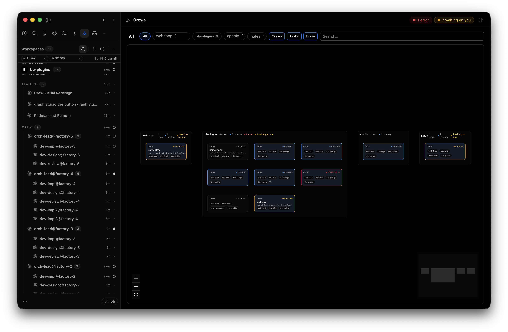
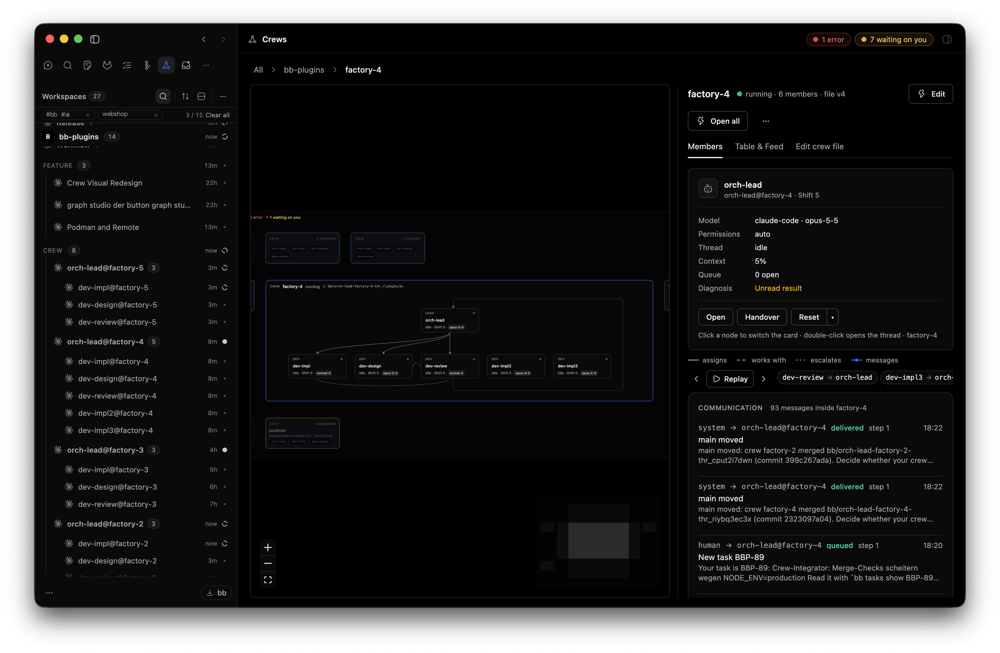

# bb-plugins

[](https://github.com/sajov/bb-plugins/actions/workflows/ci.yml)
[](https://snyk.io/test/github/sajov/bb-plugins)

Five plugins for [BB](https://github.com/get-bb). One repository, because they
share a toolchain and a set of conventions — not because they belong together.

| Plugin | What it does | Tests |
| --- | --- | --- |
| [Graph Studio](bb-plugin-graph-studio/) | Build agent graphs that may contain cycles, run them, and watch them live. A node is a BB thread, not a model call. | 660 |
| [Crew](bb-plugin-crew/) | Persistent agent teams from a `crew.yaml`: members with fixed addresses, messaging, a work queue, several crews per project. | 364 |
| [Aside](bb-plugin-aside/) | A replacement for BB's thread list. Focus through order and collapsing instead of filters. | 176 |
| [Listen](bb-plugin-listen/) | Speech in and out, fully offline with open models. Dictate in the composer, have answers read aloud. | 77 |
| [Slim Nav](bb-plugin-slim-nav/) | Icon-only sidebar navigation with adjustable density. | — |

The screenshots below are captures from a running instance; the project, file
and thread names in them are placeholders. See
[docs/screenshots](docs/screenshots/).

## Graph Studio


An agent graph is a directed graph that may contain cycles. Each node runs as
its own BB thread; LangGraph holds state, edges, cycles and checkpoints. Runs
are visible while they happen, can wait for a human answer, and can be resumed
from any checkpoint.

Thirty-one templates ship as code, from prompt chaining and routing to
evaluator–optimizer loops, supervisors, swarms and sagas.

```sh
bb plugin install git:https://github.com/sajov/bb-plugins.git \
  --subdirectory bb-plugin-graph-studio
```

## Crew





A persistent agent team: a lead and members with fixed addresses
(`dev-owner@my-crew`), each with its own provider and model, reconciled
against BB threads with `bb crew apply`. Members message each other and share
a work queue; several crews in one project coordinate through their leads, BB
Tasks and `main`. A Graph Studio `member` node runs a graph step on a crew
member instead of a fresh thread.
One zoomable canvas goes from all projects down to a single member, and
**Needs you** lists only what waits for your decision. Every message, also
between crews, is visible in the project feed and with
`bb crew log --cross-crew`.

```sh
bb plugin install git:https://github.com/sajov/bb-plugins.git \
  --subdirectory bb-plugin-crew
```

## Aside


A sidenav with projects, sections and threads — sortable, collapsible, and
deliberately without a filter box. A filter hides what you did not search for;
an order and a fold let you decide what is worth seeing.

```sh
bb plugin install git:https://github.com/sajov/bb-plugins.git \
  --subdirectory bb-plugin-aside
```

## Listen


Speech-to-text and text-to-speech that never leave the machine, built on
sherpa-onnx with Whisper and Piper models. BB's composer microphone routes
through this plugin, and answers can be read back per thread.

Requires `node` on the PATH and downloads its models on first use.


```sh
bb plugin install git:https://github.com/sajov/bb-plugins.git \
  --subdirectory bb-plugin-listen
```

## Slim Nav

Icon-only sidebar navigation with three density steps and an optional divider,
keeping BB's saved order and visibility controls.

```sh
bb plugin install git:https://github.com/sajov/bb-plugins.git \
  --subdirectory bb-plugin-slim-nav
```

## Install

Each plugin installs on its own, from the snippet in its section above. They
share nothing at install time: installing one neither needs nor pulls in the
others. Each plugin's own README covers its settings and use.

## Development

Every folder is a standalone npm package with its own `package.json`,
dependencies and tests. There is deliberately **no** workspace tooling on top:
they share no dependency, and a workspace would invent a coupling that does not
exist.

Always work inside a plugin folder, never at the root:

```sh
cd bb-plugin-graph-studio
npm install --include=dev --cache "$TMPDIR/npm-cache"
npx tsc --noEmit
npx vitest run
bb plugin build && bb plugin reload graph-studio
```

Conventions and the pitfalls that keep coming back are in
[AGENTS.md](AGENTS.md).

## Roadmap

Graph Studio is the only one under active development.

- **Free state schema, custom channels** — open. Large, and useful to power
  users only.
- **Code nodes (TypeScript)** — deliberately deferred. A node that runs code
  instead of a thread changes what a graph is; the case for it is not settled.
- **Marketplace submission** — screenshots, `PLUGIN_OVERVIEW.md` and
  third-party notices per plugin.
- **Slim Nav has no tests.** It is small and resting, but that is a gap.

### Known limitations

- **Deleting a thread in BB 0.43.1 does not delete its children.** Measured
  twice: the parent disappears, its children remain with
  `parent_thread_id = NULL` because the foreign key is `ON DELETE SET NULL`.
  Aside then shows the orphans as roots, which is the correct reaction rather
  than the cause. Deliberately not worked around — a fix would mean Aside
  deleting destructively on its own.
- **Slim Nav styles against host DOM attributes** (`data-testid`,
  `data-sidebar-navigation-*`). A BB UI change can require rework.

## Credits

Aside's card grid follows
[Dockside](https://github.com/MateoCerquetella/bb-plugins/tree/main/plugins/dockside)
by Mateo Cerquetella. Slim Nav follows the idea of
[Compact Nav](https://github.com/SawyerHood/sawyer-plugins/tree/main/plugins/compact-nav)
by Sawyer Hood. In both cases the model was adopted, not the code. Listen is
derived from [pi-listen](https://github.com/codexstar69/pi-listen) by
codexstar69; see [its licence](bb-plugin-listen/LICENSE) for the details.

## Licence

[MIT](LICENSE)
